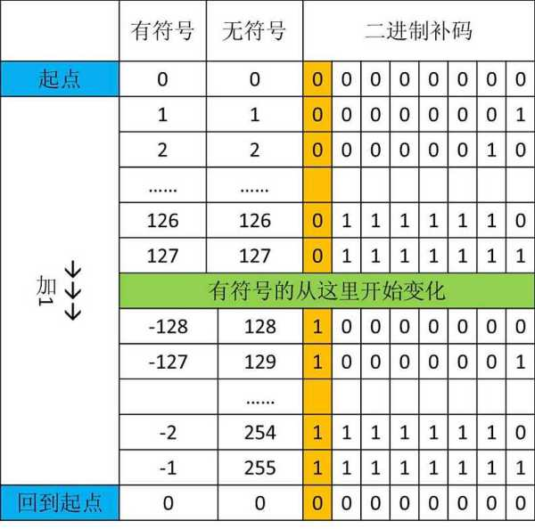

byte与bit的换算关系：1byte=8bit

### byte
* 默认值：(byte)0，占用字节数：1
* 内存结构：| --7-- | --6~0-- |，最高位为符号位，0-正，1-负，其余为数值位

### short
* 默认值：(short)0，占用字节数：2
* 内存结构：| --15-- | --14~0-- |，最高位为符号位，0-正，1-负，其余为数值位

### int
* 默认值：0，占用字节数：4
* 内存结构：| --31-- | --30~0-- |，最高位为符号位，0-正，1-负，
其余为数值位

### long
* 默认值：0L，占用字节数：8
* 内存结构：| --63-- | --62~0-- |，最高位为符号位，0-正，1-负，其余为
数值位

### float
* 默认值：0F，占用字节数：4
* 内存结构：| --31-- | --30~23-- | --22~0-- |，最高位为符号位，0-正，1-负，第二段为指数位，
是一个无符号正数
* [https://zhuanlan.zhihu.com/p/343033661](https://zhuanlan.zhihu.com/p/343033661)

### double
* 默认值：0D，占用字节数：8
* 内存结构：| --63-- | --62~52-- | --51~0-- |，最高位为符号位，0-正，1-负，第二段为指数位，
  是一个无符号正数，其余为尾数位